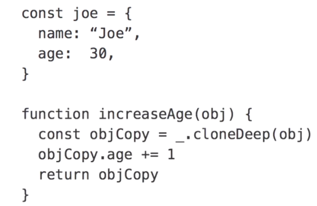

#  Functional programming
 

Functional programming keeps 
 1. functions and data separate. 
 2. It avoids state change and mutable data, and 
 3. it treats functions as first-class citizens. 

 
 ## 1. functions and data separate. 

 Object-oriented programming, as we see in this simple class representing a person, likes to group together its data with the functions in charge of operating on that data. For instance, we have this variable, age, and then we have a function in charge of incrementing the variable. In contrast, functional programming stores its data in simple constructs like arrays or hashes and makes separate functions that take the data as an argument and return some sort of transformed version of the data. 

### With argument

### returning functions

 
 ### named function
 

### returning multiple functions

### closure

clousre and returining functions to implement private variable:

Functions can be passed as arguments, and return from other functions. There's a name for functions that deal with other functions in this way, and that's higher-order functions. A higher-order function is, simply, a function that takes another function as an argument, returns another function, or both. These kind of functions are called higher-order functions because, in contrast with basic functions, which work with just data, these functions work with other functions as well. 
 

## map
 Map is used when you want to take all the elements in an array and convert them to some other value. For example, if you wanted to double all the elements in an array or convert an array of inch measurements into an array of centimeter measurements. The way we do this is by passing map an array and some function to apply to each element in the array. Map then returns another array that contains the return values of the function for each element. So in other words, it takes each element and maps it to the return value of the function we give it. If the function we pass is something like square, for example, map returns an array where each of the numbers has been squared. And of course, you can pass in an anonymous function to make it do essentially whatever you want.
 

passing ananymous function

## filter

Filter is used when you want only the elements in an array that fits some kind of criteria. For example, if you wanted only the even numbers from an array of numbers or only the employees that make more than a certain amount per year.  The only difference is that instead of passing at function that returns a value for each element in an array, you pass at a function that returns either true of false for each element.  If the function that you pass returns true for a given element, then that element is included in the final array.

 Some and every are similar to filter but instead of giving us an array's output, they simply return true or false, some returns true if the function we give it returns true for at least one of the elements in the array, every returns true only if the function we give it returns true for all of the elements in the array and false otherwise. So for example, if we have an array of all even numbers and we pass that into every along with a function that checks if each element is even, every would return true because all of the elements are even. If we pass this array into some with the same criteria, it will return true also because at least one of the elements is even. If we change one of the elements in our array so that it's odd and then pass it into every, every now returns false since all of the elements are not even, however if we pass this same array into some, it still returns true since at least one of the elements is even. If we pass an array of all odd numbers into every, it of course, returns false. And if we pass this array of all odd numbers into some, it also returns false since none of the elements are even.
 
 
 ## reduce
  Reduce takes an array and based on the function we give it, reduces the array down to a single value. 
  
 the function we pass in needs two arguments. The first argument represents the value accumulated so far, and the second represents the current element. Each time the function is called, its return value becomes the first argument for the next time it's called. So if we wanted to find the sum of all the numbers in an array, it would look like this. Note that we can also pass a third argument into Reduce.
 

0 is initial value otherwise it takes first value of array, ie in this case object

Imagine that we have an array of employee data. We want to find out how the average age of males compares with that of females. 

## callbacks
 A callback is simply a function that you pass as an argument to an asynchronous function. When the asynchronous function finishes running, it simply calls the function we passed it. Often times the asynchronous function passes its result as an argument to the function we give it.

 For example, it might pass the results that we obtain when reading from a database or reading a file. In Node.js especially, the standard form is to pass the result of the asynchronous function as the second argument, and any errors the function encounters as the first argument. 
 

# Advance concept
## partial application

 These two arguments y and z represent the last two arguments of our add function. Now we can call add5 with another argument. Notice that this gives us exactly the same result as if we had simply called add with the arguments 5, 2, and 3. So in essence, partial application works by delaying the execution of a function until we have all the required arguments. 
 
 ## recursion
 

